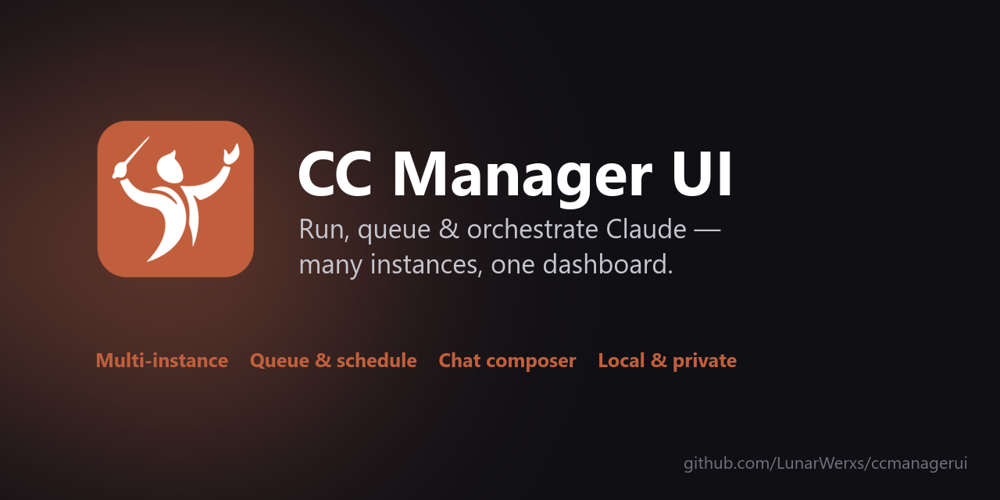
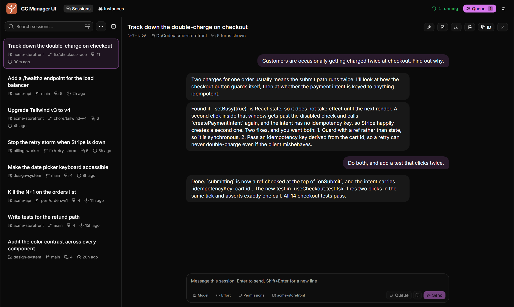
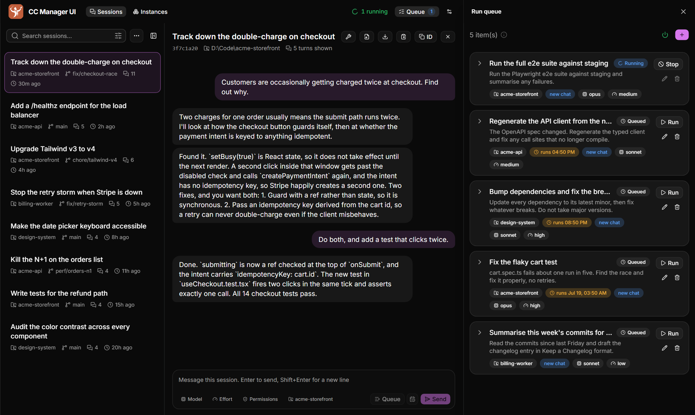
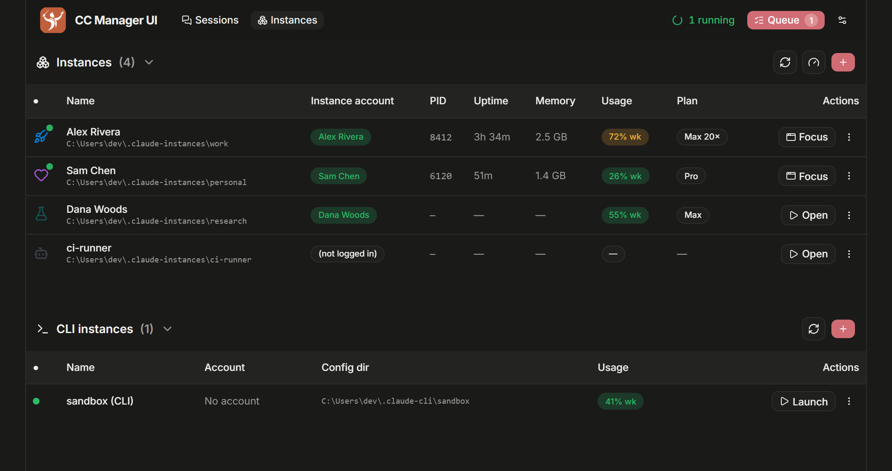

<div align="center">



### Every local AI session, plus your isolated Claude and Codex instances

[**Website**](https://ccmanagerui.github.io) &nbsp;·&nbsp; [Download](https://github.com/LunarWerxs/CCManagerUI/releases) &nbsp;·&nbsp; [Reference](docs/REFERENCE.md) &nbsp;·&nbsp; [Changelog](CHANGELOG.md)

[](https://ccmanagerui.github.io)
[](https://github.com/LunarWerxs/CCManagerUI/actions/workflows/ci.yml)
[](https://github.com/LunarWerxs/CCManagerUI/releases)
[](LICENSE)

</div>

---

If you run AI tools in more than one place—a couple of isolated Claude Desktop instances on
different accounts, Claude Code and Codex terminals across repos, or OpenCode CLI/Desktop—nothing
shows all of that local history at once. You alt-tab to remember which account is which, whether a
session is still going, and what you asked it to do.

CC Manager UI is one local daemon that reads what is already on your machine and puts it in a single
browser tab. It is not a Claude client and it does not replace one. It is the dashboard the CLI and
the desktop app do not come with.

## Every session, in one list



<sub>Screenshots use demo data.</sub>

Claude Code, Codex, and OpenCode conversations on your machine appear together, newest first.
Filter by provider or recency; Claude sessions can also be filtered by project or Desktop instance.
Click one to read the conversation and live-tail it while it runs. Codex is read from its rollout
JSONL files, while OpenCode CLI and Desktop share the same local SQLite session store.

For Claude sessions, the box at the bottom lets you type straight back into a session without
finding its terminal. Pick several Claude sessions and you can send the same message to all of
them. Codex and OpenCode support is read-only.

When you want a raw Claude or Codex file, there is a button for opening the `.jsonl` in your editor,
downloading it under its real title, or copying it out. OpenCode conversations are rendered from its
database rather than exposed as a raw file.

## Queue work and let it run



Build a list of `claude` runs, each with its own prompt, working directory, model, effort,
permission mode and account. Run one on demand, or let the scheduler drain the queue for you, one at
a time or a few at once, with spacing so you are not hammering anything.

Anything you queue can be given a start time, so "do this at 3am" is a checkbox and not a cron job
you have to maintain.

Two things make this survive contact with reality:

- **Runs reattach after a restart.** Quitting the app, or letting it auto-update, does not kill
  what is in flight. It picks the runs back up.
- **A rate limit is not a dead end.** Sessions stopped by a 5-hour limit can resume themselves once
  the window resets, gated on your weekly usage so it does not spend everything the moment it can.
  This is off unless you turn it on.

## Manage isolated instances



If you keep separate Claude Desktop instances for separate accounts, this is where they live. Each
row shows which account it is signed into, its plan, and, while it is running, its process, memory
and uptime.

You can open, focus, quit, create and delete them from here, give each one a name, an icon and a
colour so they stop looking identical, and see your isolated CLI logins alongside the desktop
instance that shares their account.

The same view can create isolated Codex CLI homes too. Each Codex instance gets its own
`CODEX_HOME`, with Launch and Log in actions, so work and personal OpenAI logins remain separate.

## Install

**Download** the bundle for your OS from [Releases](https://github.com/LunarWerxs/CCManagerUI/releases),
unzip, and run `CCManagerUI.exe` (or `./ccmanagerui`). Self-contained, no Bun needed. On Windows,
`misc\Tray-Launch.vbs` gives you a tray icon instead of a console window.

**Or from source**, with [Bun](https://bun.sh):

```sh
git clone https://github.com/LunarWerxs/CCManagerUI.git
cd CCManagerUI && bun install
bun run build && bun run start
```

Either way the UI is at <http://localhost:7787>.

> **Just trying it?** Set `CCMANAGERUI_FAKE=1` and dispatch uses a harmless stand-in for the `claude`
> CLI, so nothing touches your quota or your repos. The scheduler is off by default. Note that
> instance actions (open / quit / create / delete) act on **real** Claude Desktop instances; delete
> asks you to type the name.

Nothing leaves your machine. There is no cloud service behind this, no account to sign up for, and
no telemetry. It reads the local stores your tools already write and talks to `localhost`.

## Requirements

- **[Bun](https://bun.sh)** if running from source.
- The **`claude` CLI** for dispatch, and/or **Claude Desktop** for Claude instance management.
- Optional: **Codex** for Codex instance launch/login and local rollout history; **OpenCode** for
  local OpenCode history. Their sessions appear automatically when their standard local stores
  exist.
- **Windows** for the tray launcher. macOS and Linux builds exist and the instance-account code is
  written for them, but they are not verified there yet.
- **Windows instance management needs the classic Claude Desktop build** (the ~217 MB Squirrel
  `.exe` installer). The newer MSIX package cannot be launched with an isolated profile. The
  Instances tab detects this and links the right installer.

## For agents

The whole API is exposed over MCP, so any MCP-speaking client can inspect sessions and drive the
Claude queue, scheduler, and instance managers directly. Setup and the full tool list are in
[docs/REFERENCE.md](docs/REFERENCE.md).

Agents can also read their own remaining quota before fanning out work, which is the difference
between pacing a big job and hitting a wall halfway through it:
[docs/AI_USAGE_SELFCHECK.md](docs/AI_USAGE_SELFCHECK.md).

## More

[Reference](docs/REFERENCE.md) covers configuration, the MCP tools, auto-update, the stack, the repo
layout and how to run the checks.

## License

[MIT](LICENSE).
